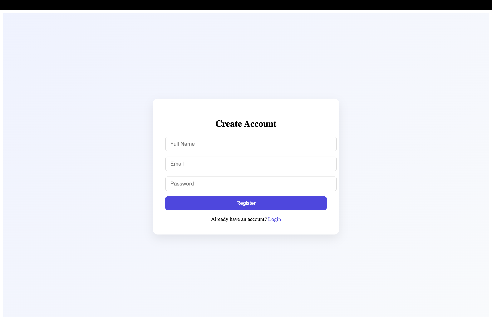
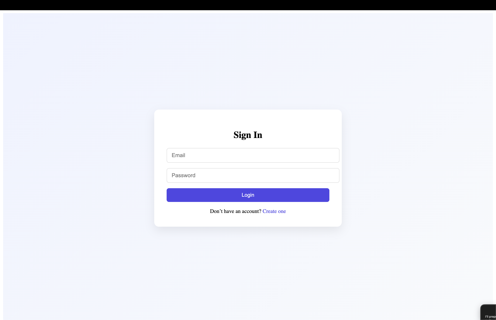
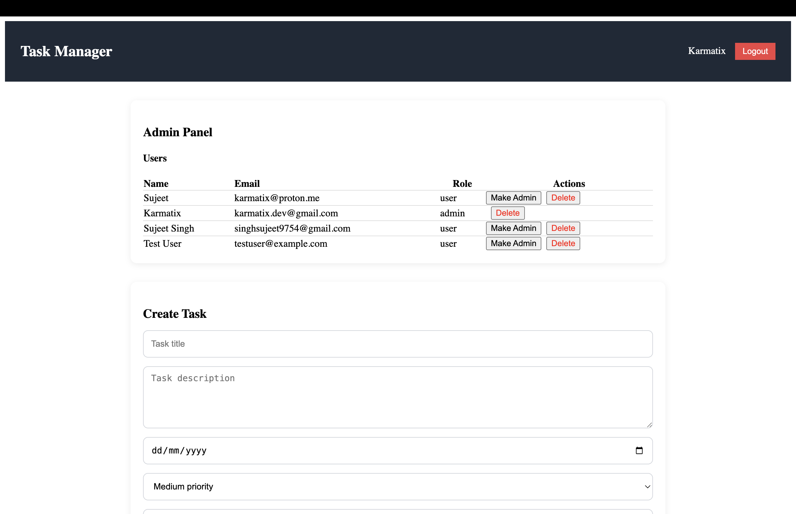
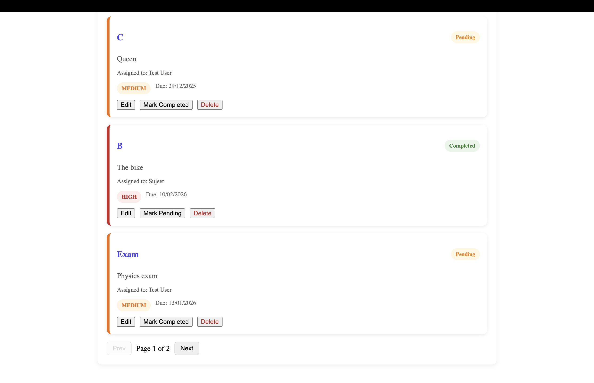
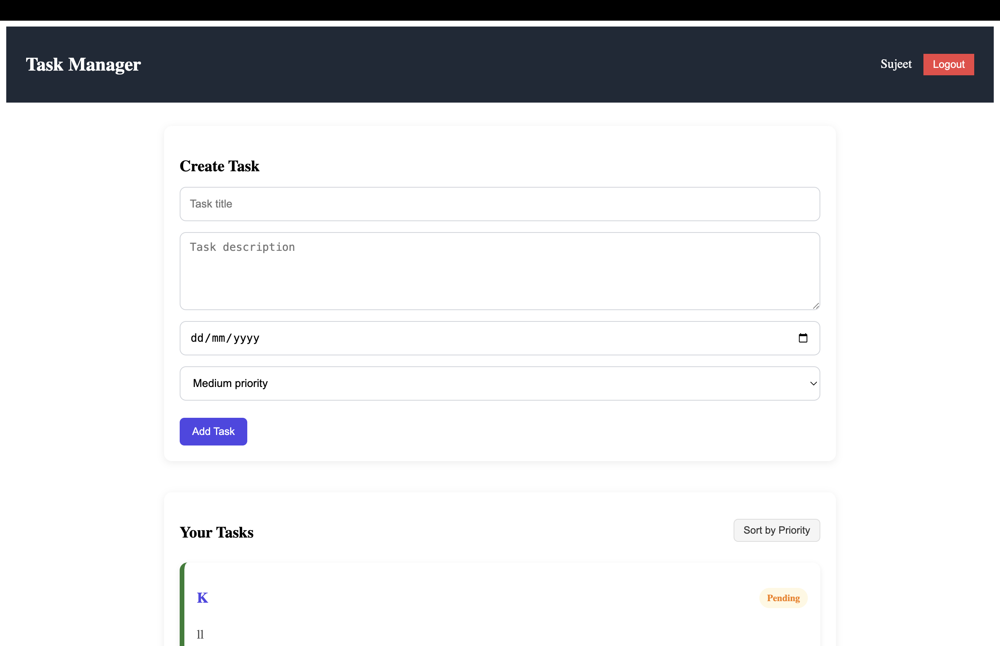
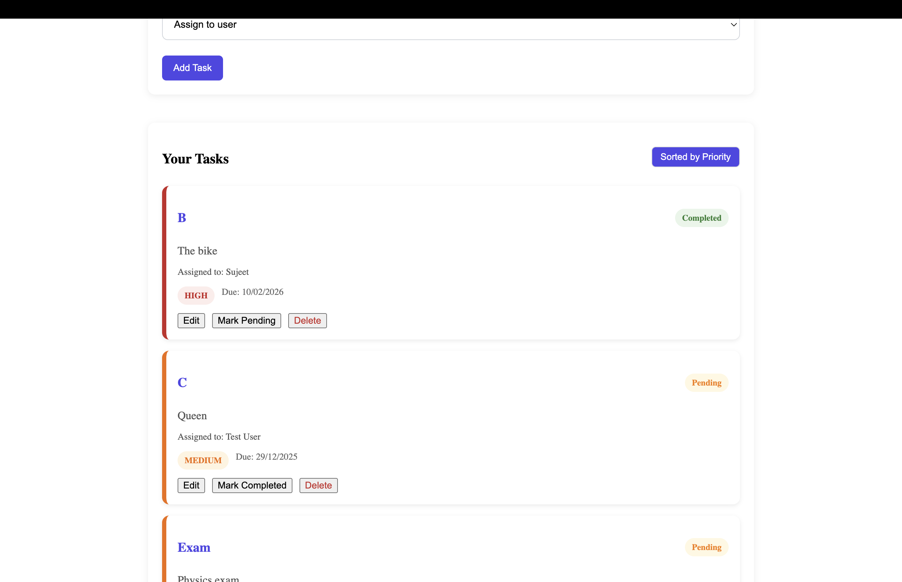
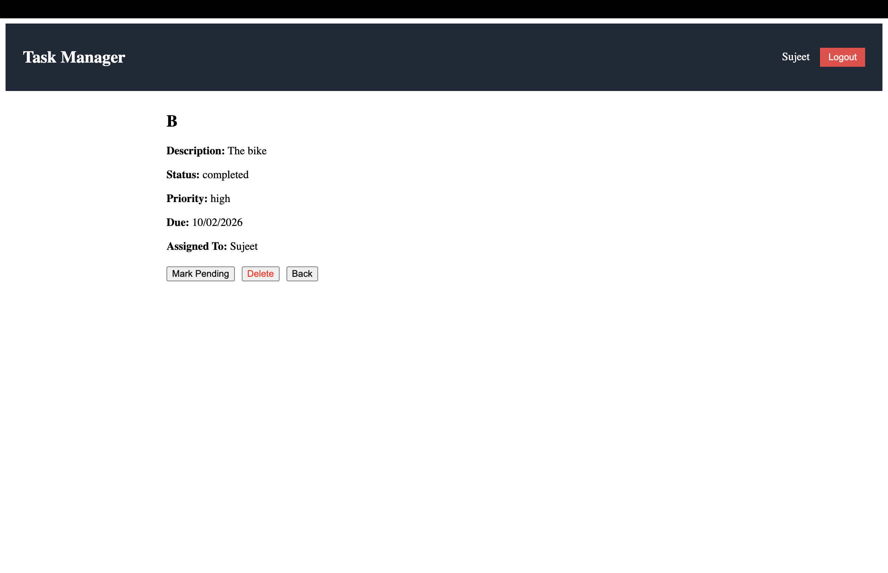

Task Management System (MERN Stack)

A full-stack task management application built using the MERN stack, supporting role-based access control, task assignment, and priority-based management.
This project demonstrates real-world backend authorization, clean frontend structure, and scalable application design.

Features-

Authentication & Authorizatio
JWT-based login and registration
Role-based access (Admin / User)
Admin defined using environment variable
Protected API routes

Task Management

Create, update, and delete tasks
Assign tasks to users (admin only)
View assigned tasks
Task detail page
Update task status (pending / completed)
Priority levels (High / Medium / Low)
Pagination support
Priority-based sorting

Admin Capabilities

View all users
Promote users to admin
Assign tasks
Delete tasks
Full access to all data

Screenshots

Tech Stack

Frontend
React
React Router
Context API
CSS
Backend
Node.js
Express.js
MongoDB
Mongoose
JWT
bcrypt

📁 Project Structure
server/
 ├── controllers/
 ├── models/
 ├── routes/
 ├── middleware/
 └── server.js

client/
 ├── components/
 ├── pages/
 ├── services/
 ├── context/
 ├── styles/

Environment Setup

Create .env inside /server:

PORT=5001
MONGO_URI=mongodb://127.0.0.1:27017/task_manager
JWT_SECRET=your_secret_key
ADMIN_EMAIL=admin@example.com

▶️ Run Locally
Backend
cd server
npm install
npm run dev

Frontend
cd client
npm install
npm run dev

Role Logic Summary
Admin

Can view all tasks
Assign tasks to any user
Delete tasks
Manage users

User

Can create tasks
Can view assigned tasks
Can update task status
Cannot assign tasks to others

📌 Notes

Admin access is controlled using environment variable

Backend enforces authorization rules

UI adapts based on user role

API protected using JWT

👨‍💻 Author

Sujeet Singh
Full Stack Developer
